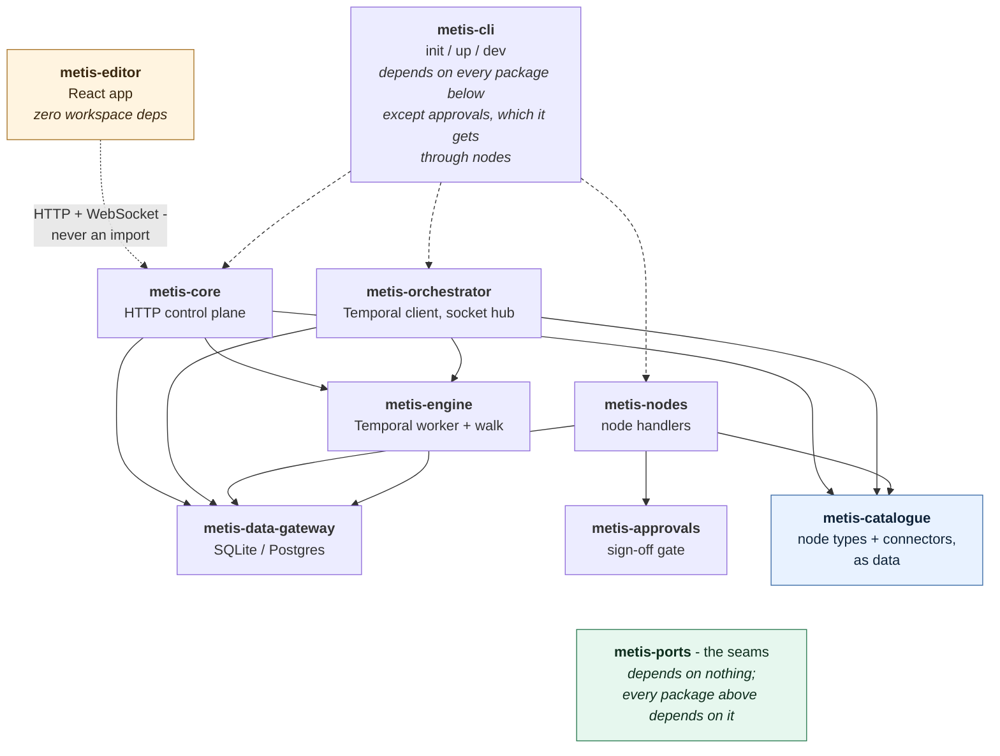
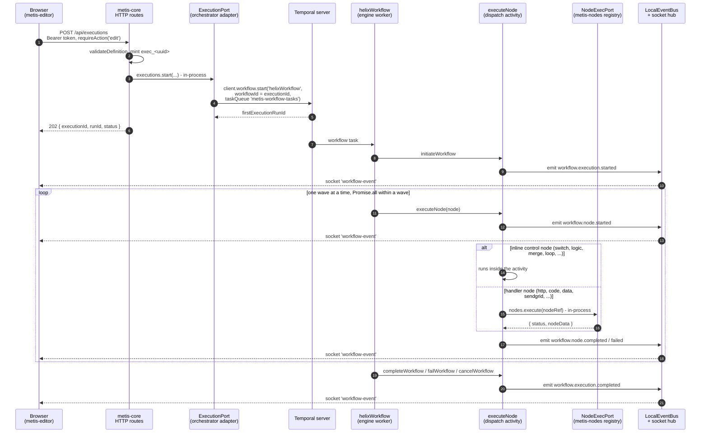
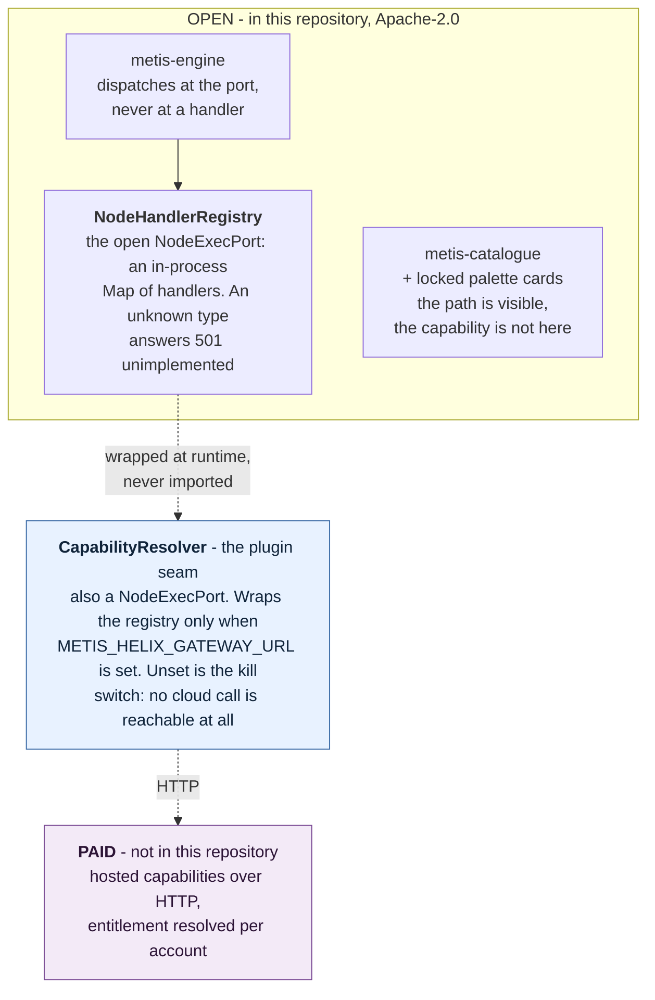
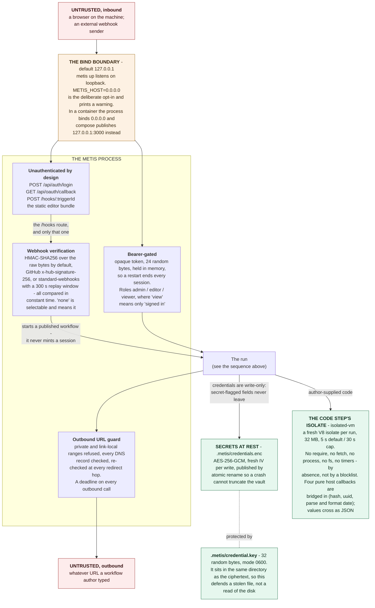

# Architecture

Metis is a TypeScript monorepo around one idea: **the workflow definition is
data, Temporal makes it durable, and every substrate is behind a port.**

The diagrams below are mermaid, which GitHub and the docs site draw natively.
Committed SVG renders sit in `docs/diagrams/` for anywhere that does not.
The markdown is the source: regenerate the SVGs with
`node scripts/render-diagrams.mjs`, which extracts each fence and calls
`npx -y @mermaid-js/mermaid-cli` on it. mermaid-cli is deliberately not a
dependency - it pulls a browser download for a script run by hand.

## The packages

Arrows point the way a dependency does: `metis-core` imports `metis-engine`,
never the reverse.

<!-- render: topology.svg -->


Two shapes in that picture are easy to get wrong:

- **`metis-core` and `metis-orchestrator` are siblings, not a chain.** Neither
  imports the other. Core reaches Temporal through the `ExecutionPort`
  interface; the orchestrator's `TemporalExecutionAdapter` is the object handed
  in for it. `metis-cli` is the only code that joins them.
- **`metis-engine` does not import `metis-nodes`.** Handlers register
  themselves into a `NodeHandlerRegistry` (a `NodeExecPort` implementation from
  `metis-ports`) and the engine dispatches through the port. That is what makes
  a closed handler set droppable in without the engine knowing.

| Package | What it is |
|---|---|
| `metis-ports` | The seams: NodeExecPort, CredentialPort, DataSourcePort, EventSink, IdentityPort, ExecutionPort + in-memory fakes and adapters. Everything depends on ports; ports depend on nothing. |
| `metis-catalogue` | Node types and connectors **as data**: `nodeTypes.v1.json` (25 types, config/output schemas, palette, docs) + `connectors.v1.json` (100 definitions). The editor renders from it; the engine validates against it. |
| `metis-engine` | The Temporal worker. `helixWorkflow` walks the definition as a one-shot DAG (waves, fan-in joins, orphan cascades); inline control nodes (switch/logic/loop/filter/merge/...) run in the dispatch activity; the Loop spawns real child workflows. Activities are the only substrate access. |
| `metis-nodes` | Open node handlers: HTTP/api, sandboxed code, the Data node's Postgres adapter, SendGrid, object store, generated connector handlers. |
| `metis-core` | The control-plane HTTP surface: auth + sessions, workflow CRUD, executions, connections (write-only credentials), the data-resource routes, catalogue serving. |
| `metis-orchestrator` | The Temporal client side: execution adapter (start/signal/cancel/describe/list), schedule service, webhook ingress verification, the Socket.IO hub streaming engine events, trigger services. |
| `metis-approvals` | The Approval node's decision handling. Open, not gated - a run that waits for a person is something a workflow engine has to have. |
| `metis-data-gateway` | Storage behind one gateway: SQLite for the laptop, Postgres for real deployments. Workflow store, execution logs, connections. |
| `metis-cli` | `metis init` / `up` / `run`; downloads and manages a local Temporal dev server, or attaches to one you already run (`METIS_TEMPORAL_ADDRESS`); collapses core + orchestrator + worker into one process. |
| `metis-editor` | The React app: React Flow canvas, schema-driven inspectors, runs pages. |

## A run, end to end

Everything except the Temporal server is **one Node process**, in both `metis
up` and the compose stack. The lifelines below are modules, not machines; the
only network hop inside a run is gRPC to Temporal - which is why pointing Metis
at a Temporal somewhere else changes nothing in this diagram but the address.

<!-- render: run-sequence.svg -->


Notes that matter when you are reading a live run:

- The activity emits through the `EventSink` port. In the open build that sink
  is a `LocalEventBus` - a `Set` of listeners in the same process - so the
  socket hub's `io.to(rooms).emit` happens on the same tick as the activity's
  `emit()`. The browser sees exactly one event name, `workflow-event`; the
  engine's own name (`workflow.node.completed` and friends) rides in
  `event.name`.
- Rooms are `tenant:<id>:workflows`, `workflow:<id>` and `execution:<id>`. The
  socket handshake carries the same bearer token the HTTP API uses.
- **The socket is not the only path.** The Run button also polls
  `GET /api/executions/:id` every 600 ms, and the Operate page every 15 s. The
  socket reads memory; the poll reads the store. A run is correct on screen
  even if the socket never connects.
- `helixApiWorkflow` is the variant for graphs that start from an API node; the
  Run button never uses it.

## The port and edition boundary

Every gated capability sits behind a port the open build already declares.
`metis.edition` in a package's `package.json` is the whole marker: `"open"`
ships, anything else is gated - a missing or misspelt marker counts as gated,
which is the safe way round.

<!-- render: edition-boundary.svg -->


Six release gates hold that boundary in place. Each guards a different input,
so no single mistake slips past all of them:

| Gate | What it reads | What it refuses |
|---|---|---|
| 1. Module boundary | every import in an open package | naming a gated package, or any memory / analytics / command-layer / agent-runtime module |
| 2. No AWS SDK | every package's dependencies | a cloud-vendor SDK in the open build |
| 3. Catalogue tier | `nodeTypes.v1.json` | shipping a node type that is not `tier: "open"` |
| 4. Identifier scan | every text file, rendered SVGs included | infra hostnames, private addresses, keys; and in prose, internal product names |
| 5. Standalone boot | every `compose/*.yml` | an external image, egress, or a published port beyond the two expected |
| 6. Doc allowlist | git's index of `*.md` | tracking any markdown not on the shippable allowlist |

All six run in `npm run gates` and again inside `npm run release-audit`. The
detail that makes them worth trusting is that each reads its own input rather
than assuming it: gate 5 treats a compose file it cannot parse as a violation,
gate 6 asks git rather than walking the filesystem, and a gate that cannot look
at all reports failure instead of success.

## Trust boundaries

<!-- render: trust-boundaries.svg -->


Four refusals worth knowing about before you deploy anything:

- **Sessions end, and sign-in costs something.** A bearer token carries an
  absolute deadline fixed at issue (default 24h) and an idle one moved forward
  by use (default 8h), both checked when the token is *used* rather than only
  by a sweep, so a token cannot outlive its window because a timer did not
  fire. The sweep runs on issue - the only path that grows the session map -
  and a cap drops the oldest entry, bounding memory as well as lifetime.
  `POST /api/auth/logout` revokes on the spot. Failed sign-ins are throttled
  per source address **and** username (default 10 per 15 minutes); successes
  are not counted and clear the tally. All five numbers are `auth` in
  `metis.config.json`; see the README for what the throttle does not stop.

- **The published default admin secret is refused.** `METIS_ADMIN_SECRET` must
  be set to something other than the built-in `metis` or Metis exits non-zero
  before it binds a port. The single opt-out is `METIS_INSECURE_DEMO=true`,
  and it must be exactly that string. This is unconditional - there is no
  environment in which the default is quietly accepted. The compose stack sets
  the opt-out deliberately, which is safe only because both of its published
  ports are pinned to loopback.
- **Rows are capped before they reach the workflow.** 1000 rows or 256 KiB,
  whichever binds first, because a node's whole output rides the workflow state
  on every hop and Temporal's payload limit is finite.
- **The data routes require `edit`.** `/api/data/validate` plans and evaluates
  author-supplied SQL through stored credentials; `view` would have been no
  guard at all, since every signed-in role has it.

## Key invariants

- **Generic I/O**: a node receives the run's state and gives one payload; only
  its config is typed. Downstream steps reference outputs as
  `{{node-<id>.data.<path>}}`, substituted in the dispatch activity.
- **Determinism**: workflow code never touches substrate; anything
  non-deterministic happens in activities and rides Temporal history.
- **Branching**: branch nodes return selected/orphaned target sets; the walker
  orphans losing branches (skipped, not failed) with convergence protection.
- **Payload discipline**: node outputs are capped (the data node ~256 KB) so
  state survives Temporal's payload limits; big data travels as references.
- **The store outlives Temporal**: the Temporal dev server forgets a run long
  before Metis does. Operate's Archive lists exactly those runs, and their
  detail pages stay fully inspectable because they read the store, not
  Temporal. How long they last is **your** policy, not ours - see
  [Retention](#retention) below.
- **Editions**: the open build is complete and self-contained; gated
  capabilities exist only as locked cards. Six release gates enforce the
  boundary structurally.

## Retention

Metis keeps every execution row - the META record and its LOG rows - **for
ever**, until you say otherwise. Deletion is opt-in, because a default that
deletes would mean the first person to upgrade quietly loses run history they
never agreed to lose.

To set a window, add `retentionDays` to `metis.config.json`:

```json
{
  "retentionDays": 90
}
```

With it set, `metis up` sweeps once at boot and then daily, deleting closed
runs whose history is older than the window. Leave it out and nothing is ever
deleted; lowering it later takes effect on the next sweep.

Two rules the sweep will not break:

- **A run that is still going is never deleted, whatever its age.** A run
  parked on a signal since April is waiting, not abandoned. Only runs that have
  actually finished - completed, failed, cancelled or terminated - are
  candidates.
- **A run is aged by when it *ended*.** A run that started ninety days ago and
  finished yesterday is a day old, and a 30-day window keeps it for another 29.

### Clearing on demand

`metis prune` clears history without waiting for the sweep. It **shows you what
would go and deletes nothing** unless you add `--yes`:

```console
$ metis prune --days 30
Would delete 41 runs (612 rows) closed more than 30 days ago.
Kept 2 still going, whatever their age.
Nothing was deleted. Re-run with --yes to delete it.

$ metis prune --days 30 --yes
Deleted 41 runs (612 rows) closed more than 30 days ago.
```

`--days` overrides `retentionDays` for that one run, so you can clear an
install that has never set a window. With neither, the command refuses rather
than guessing one. `--days 0` clears every closed run.

Temporal has its own, much shorter, visibility retention and is unaffected by
any of this; Operate's Archive is the Metis-side history described here.

## Where things happen

- Engine walk: `packages/metis-engine/src/workflows/helixWorkflow.ts`
- Node dispatch + substitution: `packages/metis-engine/src/activities/create-activities.ts`
- Definition validation (incl. cycle + loop rules): `packages/metis-engine/src/validation.ts`
- Control-plane routes: `packages/metis-core/src/*.ts`
- Webhook ingress verification: `packages/metis-orchestrator/src/webhook-ingress.ts`
- Live events: engine activities emit -> `LocalEventBus`
  (`packages/metis-ports/src/adapters/local-event-bus.ts`) -> socket hub
  (`packages/metis-orchestrator/src/socket-hub.ts`) -> the editor.
